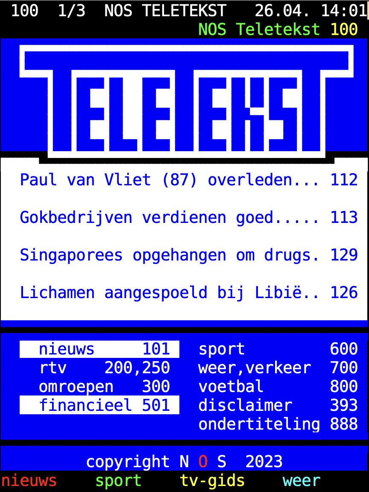

# emacs-teletext-nos

Read NOS Teletext pages in Emacs.

## Requirements

* Use-package
* Quelpa
* [Bitstream Vera Sans Mono font](http://legionfonts.com/fonts/bitstream-vera-sans-mono)
* Teletext package

## Installation

Add the `teletext-nos` package to your Emacs config. Use Quelpa until it’s available on Melpa.

```elisp
(use-package teletext-nos
  :defer t
  :init (require 'teletext-nos)
  :quelpa (teletext-nos
           :fetcher github
           :repo "Ikuyu/emacs-teletext-nos"))
```

<center></center>

## Usage

Within Emacs type `M-x teletext` [ENTER]. Use the left mouse button to click on the word `NOS` or set a key globally like this:

```elisp
(global-set-key (kbd "C-c e t") (lambda ()
                                  (interactive)
                                  (teletext)
                                  (teletext-select-network "NOS")))
```
